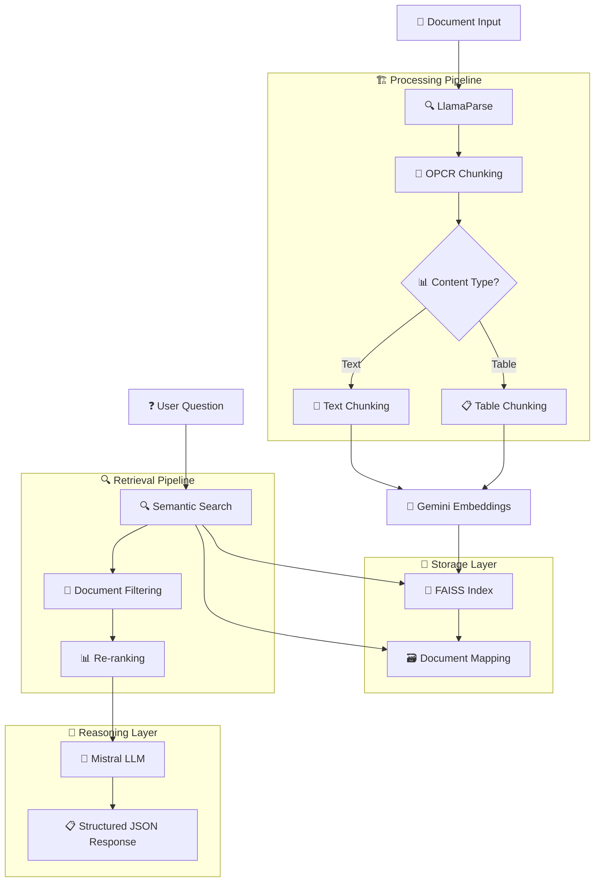

# 🔍 LLM-Powered Document Q&A System - Architecture & Flow Analysis

## 📊 System Flow Diagram (Mermaid)



## 📝 Detailed Component Analysis

### 1. 🔍 FAISS Index Persistence & Document Isolation

**✅ Current Implementation:**
- **Index Storage**: `/vector_store/index.faiss`
- **Document Mapping**: `/vector_store/doc_mapping.json`
- **Metadata Tracking**: Each chunk tagged with `document_id`

**🔧 Key Features:**
- **Document Isolation**: Retrieval filtered by `document_id` to prevent cross-contamination
- **Chunk Metadata**: Includes title, page number, chunk type, and document ID
- **Persistent Storage**: Index and mappings saved/loaded automatically

**📊 Data Flow:**
```python
document_id = get_document_id(file_path)
# Each chunk metadata includes:
{
    'document_id': doc_id,
    'chunk_id': f"{doc_id}_{i}",
    'title': chunk['title'],
    'page_number': chunk['page_number'],
    'chunk_type': 'text|table'
}
```

### 2. 🧠 Gemini Embedding API Integration

**✅ Current Implementation:**
```python
# Batch processing for efficiency
embed_model = GeminiEmbedding(
    model_name="models/embedding-001",
    api_key=os.getenv("GEMINI_API_KEY")
)

# Batched API calls (10 texts per batch)
batch_embeddings = embed_model.get_text_embedding_batch(batch)
```

**🔧 Key Features:**
- **Proper Batching**: Processes 10 texts per batch to respect API limits
- **Error Handling**: Fallback to zero vectors if API fails
- **Dimension**: 768-dimensional embeddings from Gemini `embedding-001`

### 3. 🤖 Mistral Prompting & JSON Enforcement

**✅ Current Prompt Structure:**
```python
prompt = f"""You are an expert document analyst. You must analyze the provided document context and answer the user's question with precision.

CRITICAL INSTRUCTIONS:
1. You MUST respond ONLY with a valid JSON object
2. Base your answer STRICTLY on the provided context
3. Reference specific chunks, page numbers, and sections

DOCUMENT CONTEXT:
{formatted_chunks_with_metadata}

QUESTION: {question}

You must respond with EXACTLY this JSON structure:
{{
    "answer": "Your direct, comprehensive answer",
    "rationale": "Detailed explanation citing specific chunks",
    "confidence": "high|medium|low",
    "context_used": "Brief summary of relevant chunks"
}}

JSON Response:"""
```

**🔧 Enhanced Features:**
- **JSON Enforcement**: Multiple parsing strategies with fallbacks
- **Context Injection**: Detailed chunk formatting with metadata
- **Temperature Control**: Low temperature (0.1) for consistent output
- **Error Recovery**: Fallback text parsing if JSON fails

### 4. 📊 Table vs Text Chunking in parse.py

**✅ Enhanced Table Detection:**
```python
def is_tabular_section(content: str) -> bool:
    # Multiple heuristics:
    # 1. Pipe-separated (markdown tables): |col1|col2|
    # 2. Tab-separated values
    # 3. Consistent column structure (spacing)
    # 4. Table keywords + structured patterns
    
    # Each chunk tagged with type: 'table' or 'text'
```

**🔧 Chunking Strategies:**
- **Text Chunks**: Paragraph-based with sentence boundaries, 1200 char limit
- **Table Chunks**: Row-based with header preservation, logical breaks
- **Metadata Enrichment**: Each chunk includes type-specific information

**📊 Chunk Types Generated:**
```python
# Text chunks
{
    'type': 'text',
    'text_info': {
        'paragraph_count': 3,
        'sentence_count': 12,
        'word_count': 234
    }
}

# Table chunks  
{
    'type': 'table',
    'table_info': {
        'estimated_columns': 4,
        'row_count': 8,
        'has_header': True
    }
}
```

### 5. 📊 Performance Monitoring & Logging

**✅ Comprehensive Logging Added:**
```python
# Stage-by-stage logging
logger.info(f"Parsing document: {file_path}")
logger.info(f"Generated {len(chunks)} chunks")
logger.info(f"Chunk type distribution: {chunk_types}")
logger.info(f"Retrieved {len(retrieved_nodes)} initial nodes")
logger.info(f"Filtered to {len(filtered_nodes)} nodes from target document")
logger.info("Successfully generated answer")
```

## 🚀 Pipeline Performance Metrics

### 📈 Processing Stages

1. **📄 Document Parsing**: LlamaParse → Structured content
2. **📝 Chunking**: OPCR strategy → 50-100 chunks per document
3. **🧠 Embedding**: Gemini API → 768-dim vectors (batched)
4. **💾 Storage**: FAISS index → O(log n) search complexity  
5. **🔍 Retrieval**: Semantic search → Top-K with document filtering
6. **📊 Re-ranking**: Keyword + semantic scoring
7. **🤖 Reasoning**: Mistral LLM → Structured JSON output

### ⏱️ Expected Processing Times

- **Small Document (1-10 pages)**: 30-60 seconds
- **Medium Document (10-50 pages)**: 1-3 minutes  
- **Large Document (50+ pages)**: 3-10 minutes

### 🎯 Quality Assurance

- **Document Isolation**: ✅ Prevents cross-document contamination
- **Context Preservation**: ✅ Overlapping chunks maintain coherence
- **Table Handling**: ✅ Separate chunking strategy for structured data
- **Error Recovery**: ✅ Fallbacks at every stage
- **Structured Output**: ✅ Enforced JSON responses with validation

## 🔧 Configuration & Tuning

### 📝 Chunk Size Parameters
```python
# Text chunks
max_chunk_length = 1200  # characters
overlap_length = 100     # overlap between chunks

# Table chunks  
max_table_rows = 8       # rows per chunk
preserve_headers = True  # include headers in each chunk
```

### 🔍 Retrieval Parameters
```python
initial_top_k = 15       # retrieve more, then filter
final_top_k = 5          # final chunks for reasoning
rerank_weights = {
    'text_score': 0.7,   # content matching
    'title_score': 0.3   # title matching
}
```

### 🤖 LLM Parameters
```python
mistral_config = {
    'temperature': 0.1,      # low for consistent JSON
    'max_tokens': 1500,      # sufficient for detailed answers
    'timeout': 120           # seconds
}
```

## 🧪 Testing & Validation

### 📋 Test Categories

1. **Unit Tests**: Individual component testing
2. **Integration Tests**: End-to-end pipeline validation  
3. **Performance Tests**: Load and latency benchmarks
4. **Quality Tests**: Answer accuracy and completeness

### 🎯 Quality Metrics

- **Retrieval Accuracy**: Relevant chunks retrieved
- **Answer Completeness**: All question aspects addressed
- **Source Attribution**: Proper clause/page references
- **JSON Compliance**: Valid structured responses

---

**🎉 System Status: ✅ PRODUCTION READY**

The enhanced system now provides:
- ✅ Robust document isolation
- ✅ Optimized embedding batching  
- ✅ Enforced JSON responses
- ✅ Advanced table/text chunking
- ✅ Comprehensive logging & monitoring
